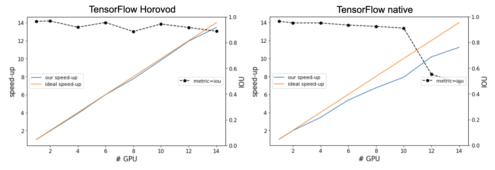

## GPU acceleration of Unet using Tensorflow native environment and Horovod

On the root directory you will find the scripts to run UNet (used for image semantic segmentation) implemented in Tensorflow using a GPU data parallel scheme in Horovod Tensorflow. In the native Tensorflow directory you will find the scripts to run the same training jobs using Tensorflow native environment without Horovod. The goal is to compare the paralleisation performance of Horovod Tensorflow vs native Tensorflow for a UNet algorithm. The data used here is an open microscopy data for semantic segmentation: . These calculations have all been done on the [RWTH high performance computing cluster](https://help.itc.rwth-aachen.de/), using Tesla V100 GPUs. 

### Virtual environment

To install Horovod for Tensorflow a virtual environment was created. The same environment will be used for both Tensorflow native and Horovod trainings so that the results are comparable. Read this [README](./environments/README.md) to see which softwares and environments need to be loaded before creating the vitual envs and running the jobs. For both native and Horovod we use NCCL as the backend for collective communications. We also use open MPI for spawning the parallel processes. 

### Data parallel scheme

A data parallel scheme is often used for large internet dataset sizes. In scientific datasets we usually have smaller dataset sizes but higher resolution images which evetually lead to OOM errors when you increase the batch size. Therefore using a data parallel scheme can be helpful. In a data parallel scheme, the mini-batch size is fixed per GPU (worker) and is usually the batch size that maxes out the GPU memory. In our case here it was 16. By having more GPUs the effective batch size increases and therefore run time decreases. This is a very common method of deep learning parallelisation. The drawback maybe that it can eventually lead to poor convergence and therefore model metrics (in our case intersection over union (IOU)) deteriorate. 

To implement the data parallel scheme the following necessary steps have been taken:

Submission:

- For native Tensorflow during the submission process, some SLURM environmental [variables](./tensorflow_native/setup_dist_env.sh) have been set up which will help us access the size and ranks of workers during training. Additionally to run Tensorflow on more than one node, a [TF_CONFIG](./tensorflow_native/tensorflow_create_tfconfig.py) env variable needs to be set that lists the IP addresses of all workers. The linked python file helps set it up for our computing cluster. For Horovod Tensorflow no env variables are required to be set up.

Training:  

- In Tensorflow native, when the jobs are run on one node, a “mirror strategy” was used and when they are run across multiple nodes a “multi worker strategy”. In Horovod Tensorflow there is no distinction between the two cases. 
  
- Learning rate: A linear scaling rule is applied to the learning rate: it means the learning rate is multiplied by the number of workers (GPUs). In addition an optional initial warm-up and a gradual scheduling might help the convergence. The warm-up is commented out in our case as it didn’t provide improvement. 
  
- Note that for parallelizing the datasets “sharding” has been added and the order of dataset operations (mapping, caching, sharding …)  matters in configuring the dataset for performance. Here we have used them in an optimal way. 

  
- Model and optimisation: In Tensorflow native the model should be wrapped in the relevant strategy (mirror or multi worker). in Tensorflow horovod the optimiser is wrapped in Horovod distributed optimizer.  

### Submission

- The submission.sh/submission_hvd.sh files submit all jobs in a loop. For our data 14 GPUs was the maximum number of GPUs which for our computing cluster correlates with 7 nodes. The submission file adapts the run_file.sh (Contatining the python script and its input arguments) and submit_file.sh (containing the submission script) for each job.
  
- Jobs run on one node, should be submitted without an MPI run. With more than one node, parallel MPI jobs are spawned by the env variable $MPIEXE in submit_file.
  
- Log files containing training times and metrics are copied in the logs folder on the root directory. 

### Notebook

This [notebook](./notebooks/Loss_curves.ipynb) has been used for post processing of log files. We use two metrics to judge the parallelisation performance. First, the deviation from an ideal linear speed-up which corresponds to increasing the computational cost. Second, the model metrics, here IOU, which might decrease in comparison with a 1 GPU scenario as the loss convergence might suffer in a data parallel scheme. 

In the figure below we compare the scaling behavior of Unet for Tensorflow native and Tensorflow Horovod. For Tensorflow native the speed-up deviates rather quickly from the ideal speed-up and also the model metric (Here IOU) deteriorates at higher GPU numbers. Tensorflow Horovod seems to outperform native Tensorflow. We have repeated these calculation with different seeds and the behaviours observed here seem to be consistent.

